# Pilates - Your Guide to Flexible Fun

'Pilates - Your Guide to Flexible Fun' is a single page site that aims to help encourage people to try pilates by teaching them how it's possible to keep fit AND flexible through controlled movements. The site will be targeted toward people of all ages who are looking for a way to workout out from the comfort of their homes without the need for equipment and keep themselves fit. This site will be useful for people who are interested in pilates or similar fitness systems and want to gain more knowledge.

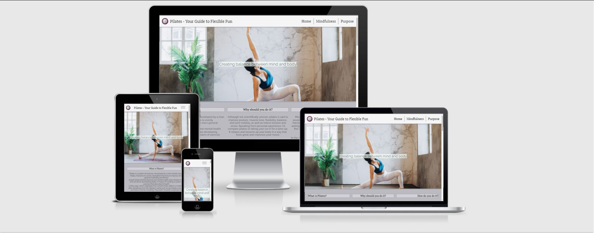

## Features

Each feature listed below was chosen to provide users with a clear, logical path through the site content in order for this project to achieve its goal.

### Existing features
* Navigation bar
  * Positioned at the top of the page, the full-length responsive navigation bar includes the site name, logo, and links to the home page, 'Mindfulness' sub-sections - 'Body' and 'Mental Health' and 'Purpose' section.
  * The 'Mindfulness' sub-sections become accessible from a dropdown menu when 'Mindfulness' is hovered in order to economise on space.
  * The navigation bar layout adjusts to make use of available space on smaller screens, eventually becoming a burger menu when there is no longer enough space to display the words in the bar. This provides value for the user through ease of navigation by placing it in the position users typically expect to see a navigation bar.

    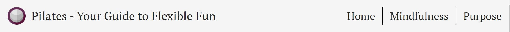
    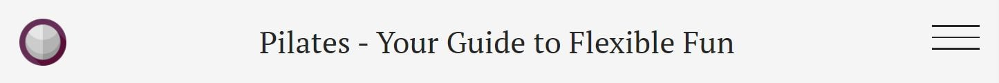
    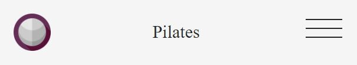

* Landing page image
    * A photograph with text overlay is displayed to set the tone/aesthetic for the page.
    
    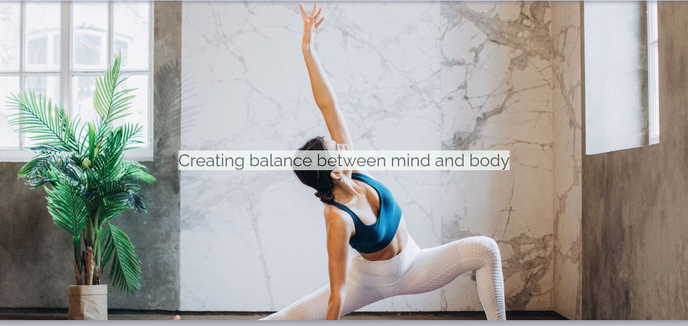

* Intro
    * The intro will answer 3 FAQs people typically have about pilates and give a brief overview of its background and benefits, allowing the user to get a high level idea of what pilates is about and what lies ahead if they continuing going through the site content.

    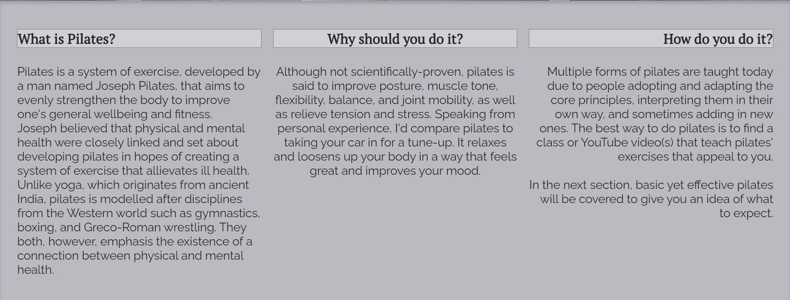

* Mindfulness - Body section
    * The 'Body' section will argue the importance of taking care of and paying attention to the body in order for it not to reach breaking point due to inactivity or not living a healthy lifestyle.
    * It provides links to 3 pilates YouTube videos to demonstrate pilates techniques to the user in the form of workout routines that last no longer than 30 minutes. This gives the user a visual learning experience rather than displaying more images of techniques paired with text.
    * A sticky image, depicting a woman executing a pilates technique/stretch for opening up the body's hip flexors, is shown to add movement to an otherwise static page but also to provide a user with an image relating to the section.

    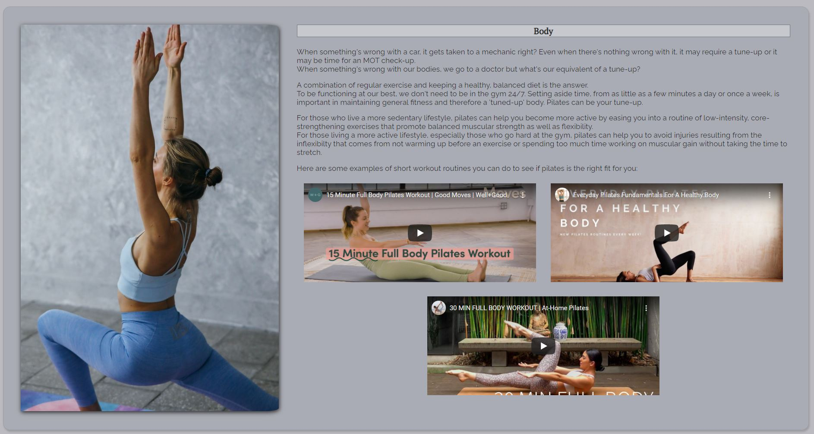

* Mindfulness - Mental Health section
    * The 'Mental Health' section will discuss the importance of reducing stress and taking time out to focus on one's self.
    * It also provides links to 2 short YouTube videos to demonstrate pilates techniques and streches to the user that are a good way to relax and wind down for the day. This adds to the user's visual learning experience started in the previous section.
    * A sticky image, depicting a woman relaxing, is shown to add movement to an otherwise static page but also to provide a user with an image relating to the section.

    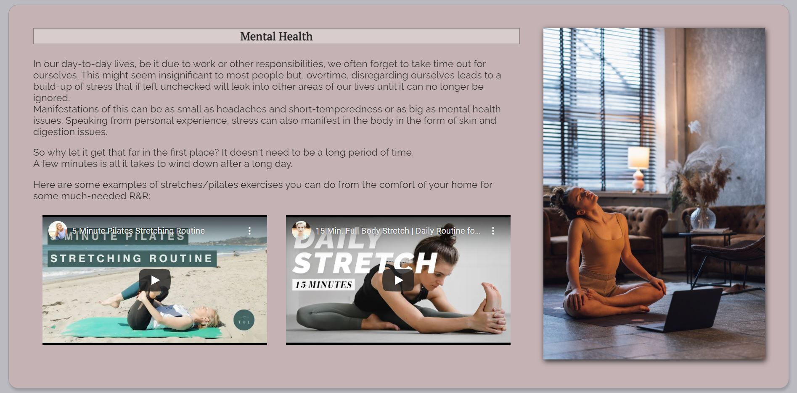
    
* Purpose section
    * The 'Purpose' section will conclude the page, briefly highlighting the aim of the webpage and listing recommended apps in the form of QR codes. This provides the user with more material that can help them with pilates and/or with relaxation if they are interested.

    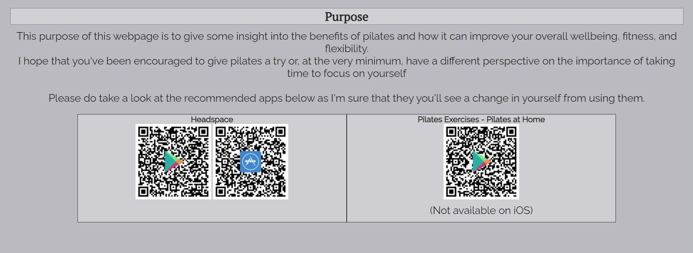

* Footer
    * The footer will provide:
        * a subscription form that gives the user the option to provide their email address if they would like to receive more app and YouTube video recommendations
        * a license declaration
        * a list of the navigation links within the page

    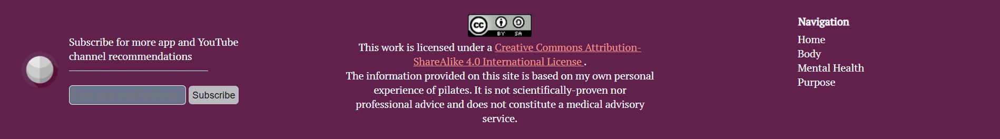

## Testing
### Validator testing
* HTML
    * There were 12 HTML errors found, as shown below, and fixed after passing through the official [W3C Markup Validator](https://validator.w3.org/nu/?doc=https%3A%2F%2Fdebzdk.github.io%2Fpilates-your-guide-to-flexible-fun%2F).
    
    
    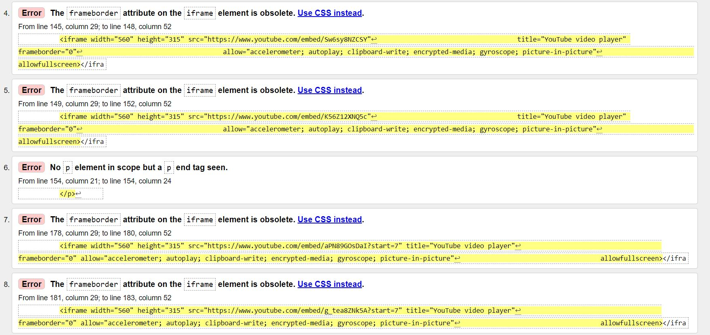
    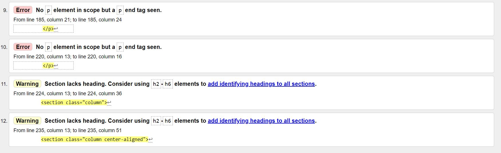

* CSS
    * 1 error was found and fixed (see commit [here](https://github.com/DebzDK/pilates-your-guide-to-flexible-fun/commit/13cf30d710514d969eed371f093967e1288a7826)) after passing through the official [(Jigsaw) validator](http://jigsaw.w3.org/css-validator/validator?uri=https%3A%2F%2Fdebzdk.github.io%2Fpilates-your-guide-to-flexible-fun&profile=css3svg&usermedium=all&warning=1&vextwarning=).
    * There is 1 warning regarding use of a vendor extension. The CSS referred to in this warning is necessary for compatibility in IE.

* Accessibility
    * 1 error and 9 alerts were found and fixed after running the [WAVE Accessibility Evaluation tool](https://wave.webaim.org/report#/https://debzdk.github.io/pilates-your-guide-to-flexible-fun).

    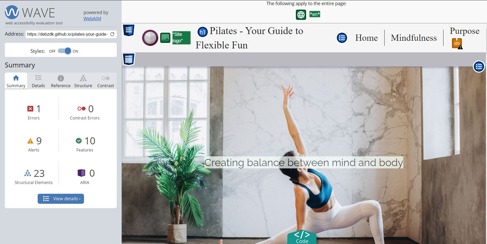
    

    * Manual foreground and background colour testing
        * Navigation bar
            * Text\
            Contrast Ratio: <b>[13.88:1](https://webaim.org/resources/contrastchecker/?fcolor=262626&bcolor=F5F5F5)</b>
            * Menu item hover\
            Contrast Ratio: <b>[10.52:1](https://webaim.org/resources/contrastchecker/?fcolor=F5F5F5&bcolor=61214C)</b>
            * Dropdown menu item\
            Contrast Ratio: <b>[7.82:1](https://webaim.org/resources/contrastchecker/?fcolor=262626&bcolor=BABABF)</b>
            * Dropdown menu item hover\
            Contrast Ratio: <b>[11.41:1](https://webaim.org/resources/contrastchecker/?fcolor=262626&bcolor=DDDDDD)</b>
        * Landing page image overlay\
        Contrast Ratio: <b>[14.82:1](https://webaim.org/resources/contrastchecker/?fcolor=262626&bcolor=F5FFFA)</b>
        * Body\
        Contrast Ratio: <b>[7.82:1](https://webaim.org/resources/contrastchecker/?fcolor=262626&bcolor=BABABF)</b>
        * Footer
            * Text\
            Contrast Ratio: <b>[14.82:1](https://webaim.org/resources/contrastchecker/?fcolor=FFFFFF&bcolor=61214C)</b>
            * Links\
            Contrast Ratio: <b>[11.47:1](https://webaim.org/resources/contrastchecker/?fcolor=F29188&bcolor=61214C)</b>

### Fixed bugs

### Unfixed bugs

## Deployment

## Credits