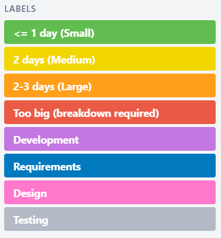
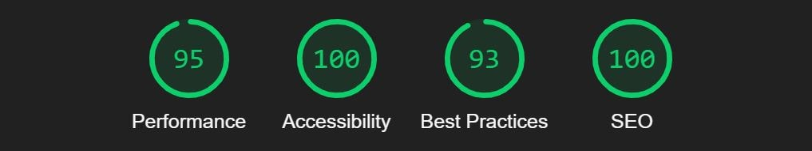
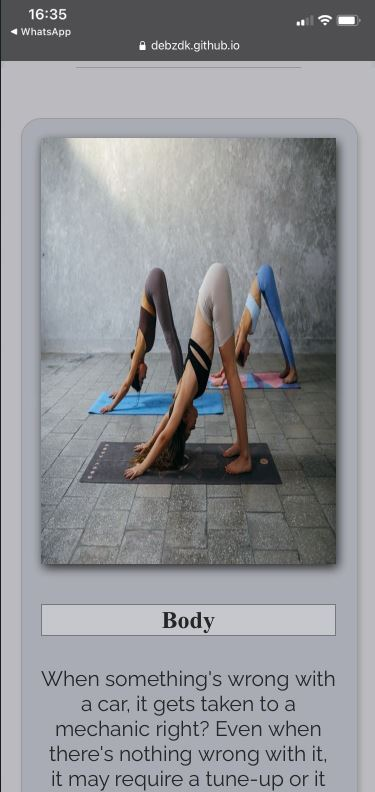
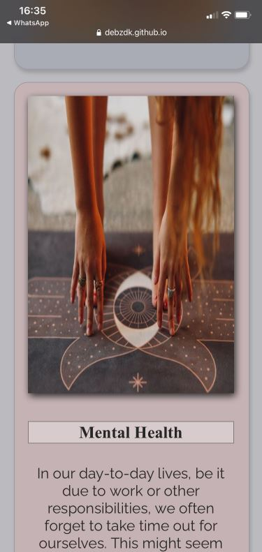

# Pilates - Your Guide to Flexible Fun

'Pilates - Your Guide to Flexible Fun' is a single page site that aims to help encourage people to try pilates by teaching them how it's possible to keep fit AND flexible through controlled movements. The site will be targeted toward people of all ages who are looking for a way to workout out from the comfort of their homes without the need for equipment and keep themselves fit. This site will be useful for people who are interested in pilates or similar fitness systems and want to gain more knowledge.

## Design

### Wireframes

To kickstart the project design process, hand-drawn wireframes were created in order to visualise different potential project ideas. These can be found [here](documentation/wireframes/hand-drawn-wireframes.pdf).
 
After talking through these ideas during the Mentor Project Planning session, the wireframes for the chosen project idea were re-created digitally using Balsamiq.

### Typography

Google Fonts was used to find and select fonts for the site's typography.
 

'[PT-Serif](https://fonts.google.com/specimen/PT+Serif)' is used for headings and the navigation bar and footer text.
'[Raleway](https://fonts.google.com/specimen/Raleway)' is used for all other text.

### Colours

The site's colour scheme was chosen using the Adobe Color scheme extraction tool and an [image](https://www.google.com/search?q=sunset+pilates&tbm=isch&ved=2ahUKEwjzkcyagfXyAhUT8xoKHXw4CEcQ2-cCegQIABAA&oq=sunset+pilates&gs_lcp=CgNpbWcQAzIFCAAQgAQyBAgAEBgyBAgAEBgyBAgAEBgyBAgAEBgyBAgAEBgyBAgAEBg6CAgAEIAEELEDOgsIABCABBCxAxCDAToGCAAQCBAeOggIABAIEAoQHjoECAAQHlCCPljaR2DQSWgAcAB4AIABYIgB-gOSAQE3mAEAoAEBqgELZ3dzLXdpei1pbWfAAQE&sclient=img&ei=VqA7YfOOK5Pma_zwoLgE&bih=762&biw=1535&rlz=1C1CHBF_enGB848GB848#imgrc=uMSFgODXB9XbRM) found from a Google search for 'sunset pilates'.
 
All colours except #F2DAC4 were used.

### Planning and execution

Agile practices were used to carry out this project and documented in Trello ([planning/design board](https://trello.com/b/XHKOeDeS/project-planning-design) and [dev board](https://trello.com/b/uPJVG04m/project-development)) and [Github Projects](https://github.com/DebzDK/pilates-your-guide-to-flexible-fun/projects/1).
 
*Please note that more task details + resources are available in the Trello boards than in the Github Project page.*

Each board is divided into 3 swimlanes/columns:
* 'To Do' - used to list tasks that are yet to be done
* 'In Progress' - used to list tasks that are currently being carried out
* 'Done' - used to list completed tasks

After defining the status divisions for a task, the indicators for time constraints were defined using 't-shirt sizes'.

‘T-shirt sizes’ were defined to provide an estimate for the perceived difficulty of a task and extra labels to further separate tasks by what part of the process they’re related to, i.e. Requirements, Design, Development, and Testing.
The project area labels have been defined as follows:
* ‘Requirements’ - refers to things that are directly taken from or related to the project’s assessment criteria rather than actions derived from a requirements capture process
* 'Design' - refers to steps taken towards the appearance of the website
* 'Development' - refers to steps taken towards the implementation of the website
* 'Testing' - refers to steps taken towards validating the HTML and CSS as well as testing the responsiveness of the website

At this point, user stories were created in order to produce tasks while thinking from a user's perspective.

All other user stories follow the same kind of format except for where the user story is self-explanatory of the task.
 
*Please note that user stories for 'Testing' were not made at the time that tests were carried out as they should have been but have been added after the fact, using the time of relevant commits to provide a rough duration estimate.* 

## Features

Each feature listed below was chosen to provide users with a clear, logical path through the site content in order for this project to achieve its goal.

### Existing features

* Navigation bar
  * Positioned at the top of the page, the full-length responsive navigation bar includes the site name, logo, and links to the home page, 'Mindfulness' sub-sections - 'Body' and 'Mental Health' and 'Purpose' section.
  * The 'Mindfulness' sub-sections become accessible from a dropdown menu when 'Mindfulness' is hovered in order to economise on space.
  * The navigation bar layout adjusts to make use of available space on smaller screens, eventually becoming a burger menu when there is no longer enough space to display the words in the bar. This provides value for the user through ease of navigation by placing it in the position users typically expect to see a navigation bar.

    
    
    
    

* Landing page image
    * A photograph with text overlay is displayed to set the tone/aesthetic for the page.
    
    

* Intro
    * The intro will answer 3 FAQs people typically have about pilates and give a brief overview of its background and benefits, allowing the user to get a high level idea of what pilates is about and what lies ahead if they continuing going through the site content.

    

* Mindfulness - Body section
    * The 'Body' section will argue the importance of taking care of and paying attention to the body in order for it not to reach breaking point due to inactivity or not living a healthy lifestyle.
    * It provides links to 3 pilates YouTube videos to demonstrate pilates techniques to the user in the form of workout routines that last no longer than 30 minutes. This gives the user a visual learning experience rather than displaying more images of techniques paired with text.
    * A sticky image, depicting a woman executing a pilates technique/stretch for opening up the body's hip flexors, is shown to add movement to an otherwise static page but also to provide a user with an image relating to the section.

    

* Mindfulness - Mental Health section
    * The 'Mental Health' section will discuss the importance of reducing stress and taking time out to focus on one's self.
    * It also provides links to 2 short YouTube videos to demonstrate pilates techniques and streches to the user that are a good way to relax and wind down for the day. This adds to the user's visual learning experience started in the previous section.
    * A sticky image, depicting a woman relaxing, is shown to add movement to an otherwise static page but also to provide a user with an image relating to the section.

    
    
* Purpose section
    * The 'Purpose' section will conclude the page, briefly highlighting the aim of the webpage and listing recommended apps in the form of QR codes. This provides the user with more material that can help them with pilates and/or with relaxation if they are interested.

    

* Footer
    * The footer will provide:
        * a subscription form that gives the user the option to provide their email address if they would like to receive more app and YouTube video recommendations
        * a license declaration
        * a list of the navigation links within the page

    

### Future features

* Mailing list

    The ability to generate a mailing list from subscription form submissions and automatically send emails would have been a nice addition to the site. Users could then actually receive more information/recommendations on pilates exercises and apps.
     
    [MailChimp](https://mailchimp.com/features/custom-forms/) would have been a decent candidate for this functionality because it removes the need to build a backend. This would've required the use of a language other than HTML and CSS and is therefore beyond the scope of this project.

## Languages and technologies used

* Languages
    * [HTML](https://en.wikipedia.org/wiki/HTML)
    * [CSS](https://en.wikipedia.org/wiki/CSS)
        * [Flexbox](https://en.wikipedia.org/wiki/CSS_Flexible_Box_Layout)
* Technologies
    * [Git](https://git-scm.com/)
    * [GitHub](https://github.com/)
    * [Gitpod](https://gitpod.io/)
        * The terminal was used to create branchs to work on before merging into the main branch. These branches has been preserved for the sake of the assessment, otherwise they would have been deleted after use.
        *Note: initial merges were missing the '--no-ff' flag so commit history was lost*

        

## Testing

### Validator testing

* HTML
    * There were 12 HTML errors found, as shown below, and fixed after passing through the official [W3C Markup Validator](https://validator.w3.org/nu/?doc=https%3A%2F%2Fdebzdk.github.io%2Fpilates-your-guide-to-flexible-fun%2F).
    
    
    
    

* CSS
    * 1 error was found and fixed (see commit [here](https://github.com/DebzDK/pilates-your-guide-to-flexible-fun/commit/13cf30d710514d969eed371f093967e1288a7826)) after passing through the official [(Jigsaw) validator](http://jigsaw.w3.org/css-validator/validator?uri=https%3A%2F%2Fdebzdk.github.io%2Fpilates-your-guide-to-flexible-fun&profile=css3svg&usermedium=all&warning=1&vextwarning=).
    * There are 5 warnings regarding use of vendor extensions. The CSS referred to in these warnings are necessary for compatibility in Safari, IE/Microsoft Edge, and Firefox.

* Accessibility
    * 1 error and 9 alerts were found and fixed after running the [WAVE Accessibility Evaluation tool](https://wave.webaim.org/report#/https://debzdk.github.io/pilates-your-guide-to-flexible-fun).

    
    
    

    * Manual foreground and background colour testing
        * Navigation bar
            * Text\
                Contrast Ratio: <b>[13.88:1](https://webaim.org/resources/contrastchecker/?fcolor=262626&bcolor=F5F5F5)</b>
            * Menu item hover\
                Contrast Ratio: <b>[10.52:1](https://webaim.org/resources/contrastchecker/?fcolor=F5F5F5&bcolor=61214C)</b>
            * Dropdown menu item\
                Contrast Ratio: <b>[7.82:1](https://webaim.org/resources/contrastchecker/?fcolor=262626&bcolor=BABABF)</b>
            * Dropdown menu item hover\
                Contrast Ratio: <b>[11.14:1](https://webaim.org/resources/contrastchecker/?fcolor=262626&bcolor=DDDDDD)</b>
        * Landing page image overlay\
            Contrast Ratio: <b>[14.82:1](https://webaim.org/resources/contrastchecker/?fcolor=262626&bcolor=F5FFFA)</b>
        * Body\
            Contrast Ratio: <b>[7.82:1](https://webaim.org/resources/contrastchecker/?fcolor=262626&bcolor=BABABF)</b>
        * Footer
            * Text\
                Contrast Ratio: <b>[11.47:1](https://webaim.org/resources/contrastchecker/?fcolor=FFFFFF&bcolor=61214C)</b>
            * Links\
                Contrast Ratio: <b>[5.01:1](https://webaim.org/resources/contrastchecker/?fcolor=F29188&bcolor=61214C)</b>

* Lighthouse
    * Initial report
        * Desktop

        
        
        

        *Note: The issues logged in the 'Issues' panel of Chrome DevTools are unrelated to the site itself and therefore cannot be fixed*

        

        * Mobile

            

    * Secondary report
        * Desktop - (report can be found [here](https://htmlpreview.github.io/?https://github.com/DebzDK/pilates-your-guide-to-flexible-fun/blob/main/documentation/reports/secondary-lighthouse-desktop-report.html))
        
        
        
        * Mobile - (report can be found [here](https://htmlpreview.github.io/?https://github.com/DebzDK/pilates-your-guide-to-flexible-fun/blob/main/documentation/reports/secondary-lighthouse-mobile-report.html))
        
        

### Fixed bugs
* Scaling issues with 'Mindfulness' section content images
    
    * iPhone and Firefox

        This issue was discovered on an iPhone after sending a link to the site to my family members to get help testing responsiveness on different devices, in addition to using Chrome DevTools to do the same test.

        * Before fix

            
            

        * After fix (see commit [here](https://github.com/DebzDK/pilates-your-guide-to-flexible-fun/commit/07fa2a3404067d527fff23a5e0052c6fd749121d#diff-a72d4ee198d130c997b203ecb2f5c54d84617b3cdf7bd9eaab804be78e2709ae), re-tested using the [LambdaTest cross-browser testing tool](https://www.lambdatest.com/)):

            
            

    * iPad Pro

        When viewing the site using the Chrome DevTools > Toggle device toolbar > iPad Pro display, the mindfulness body section image is too large and pushs the text out of view.

        * Before fix

        

        * After fix (see first change in commit [here](https://github.com/DebzDK/pilates-your-guide-to-flexible-fun/commit/3d7c445964c9c2d8ff06b38244fc15a46b8fa92c#diff-a72d4ee198d130c997b203ecb2f5c54d84617b3cdf7bd9eaab804be78e2709ae))

        
        
    * 4K 

        When viewing the site using the Chrome DevTools > Toggle device toolbar > 4K display, the mindfulness section images are overly streched.

        * Before fix

        

        * After fix (see second change in commit [here](https://github.com/DebzDK/pilates-your-guide-to-flexible-fun/commit/3d7c445964c9c2d8ff06b38244fc15a46b8fa92c#diff-a72d4ee198d130c997b203ecb2f5c54d84617b3cdf7bd9eaab804be78e2709ae))

        

        *Note: YouTube video images are distorted due to zoom.*
        
## Deployment

The site was deployed to GitHub pages using the steps listed below: 
* In the GitHub repository, navigate to the Settings tab
* From the source section drop-down menu, select the 'main' branch
    
* Once the 'main' branch has been selected, the page will be automatically refreshed and indicate the state of deploymeny (which should eventually show as successful)
    
    

The live link can be found here - https://debzdk.github.io/pilates-your-guide-to-flexible-fun

### Local deployment

Since my work is in a publicly-accesible repository, it can be plagiarised in 3 different ways:

1. Cloning the repository

    <code>git clone https://github.com/DebzDK/pilates-your-guide-to-flexible-fun.git</code>

1. Forking the repository

    

1. Using Gitpod to create a new workspace for the repository via https://gitpod.io/#https://github.com/DebzDK/pilates-your-guide-to-flexible-fun

## Credits

### Content

The introductory content of the webpage, located under the landing page image, is based on information sourced from the [NHS](https://www.nhs.uk/live-well/exercise/guide-to-pilates/) and [Wikipedia](https://en.wikipedia.org/wiki/Pilates).

All other content in this webpage is written in my own words and of my own opinion.

### Media

All images were compressed using [Compress JPEG](https://compressjpeg.com/).

* Header image

    

* Mindfulness seciton images

    
    
    
    

 

Purpose | Credit | Source
------------ | ------------- | -------------
Logo | [Freepik](https://www.flaticon.com/authors/freepik) | [Flat icon](https://www.flaticon.com/free-icon/pilates-ball_674720)
Landing page image | [Elina Fairytale](https://www.pexels.com/@elly-fairytale?utm_content=attributionCopyText&utm_medium=referral&utm_source=pexels) | [Pexels](https://www.pexels.com/photo/woman-in-blue-sports-bra-and-white-leggings-doing-yoga-3822220/?utm_content=attributionCopyText&utm_medium=referral&utm_source=pexels)
Body section image 1 (portrait/large screens) | [KoolShooters](https://www.pexels.com/@kool-shooters?utm_content=attributionCopyText&utm_medium=referral&utm_source=pexels) | [Pexels](https://www.pexels.com/photo/healthy-people-woman-relaxation-6246693/?utm_content=attributionCopyText&utm_medium=referral&utm_source=pexels)
Body section image 2 (landscape/smaller screens) | [KoolShooters](https://www.pexels.com/@kool-shooters?utm_content=attributionCopyText&utm_medium=referral&utm_source=pexels) | [Pexels](https://www.pexels.com/photo/healthy-people-woman-relaxation-6246693/?utm_content=attributionCopyText&utm_medium=referral&utm_source=pexels)
Mental health section image 1 (portrait/larger screens) | [KoolShooters](https://www.pexels.com/@kool-shooters?utm_content=attributionCopyText&utm_medium=referral&utm_source=pexels) | [Pexels](https://www.pexels.com/photo/healthy-sea-beach-vacation-6246589/?utm_content=attributionCopyText&utm_medium=referral&utm_source=pexels)
Mental health section image 2 (landscape/smaller screens) | [KoolShooters](https://www.pexels.com/@kool-shooters?utm_content=attributionCopyText&utm_medium=referral&utm_source=pexels) | [Pexels](https://www.pexels.com/photo/woman-in-brown-tank-top-sitting-on-floor-6246203/?utm_content=attributionCopyText&utm_medium=referral&utm_source=pexels)
Creative Commons licence image | [Creative Commons](https://creativecommons.org/) | [Creative Commons](https://creativecommons.org/choose/results-one?license_code=by-sa&amp;jurisdiction=&amp;version=4.0&amp;lang=en)
'15 Minute Full Body Pilates Workout' video | [YouTube](https://www.youtube.com/watch?v=510FdqCvZ-k&ab_channel=Well%2BGood) | [Well+Good](https://www.youtube.com/channel/UC1bcqvAnNsBoq_RWJNxYvhQ0)
'Everyday Pilates Fundamentals for a Healthy Body' video | [YouTube](https://www.youtube.com/watch?v=Sw6sy8NZCSY&ab_channel=LottieMurphy) | [Lottie Murphy](https://www.youtube.com/channel/UCPbNqkl2HGn-w3PkymV1GTw)
'30 Min Full Body Workout' video | [YouTube](https://www.youtube.com/watch?v=K56Z12XNQ5c&t=117s&ab_channel=MoveWithNicole) | [Move With Nicole](https://www.youtube.com/channel/UCEbbyBuyQiHpKiOMj9GFhVw)
'5-Minute Pilates Stretching Routine' video | [YouTube](https://www.youtube.com/watch?v=aPN89GOsDaI&t=7s&ab_channel=TheBalancedLifePilateswithRobinLong) | [The Balanced Life Pilates With Robin Long](https://www.youtube.com/channel/UCjXa9ErUqMDzaI3plO8a-FA)
'15 Min. Full Body Stretch' video | [YouTube](https://www.youtube.com/watch?v=g_tea8ZNk5A&t=7s&ab_channel=MadyMorrison) | [Mady Morrison](https://www.youtube.com/channel/UCHJBoCDxaCTRrwCHXEBA-BA)
QR codes | [QRCode Monkey](https://www.qrcode-monkey.com/) | [QRCode Monkey](https://www.qrcode-monkey.com/)

